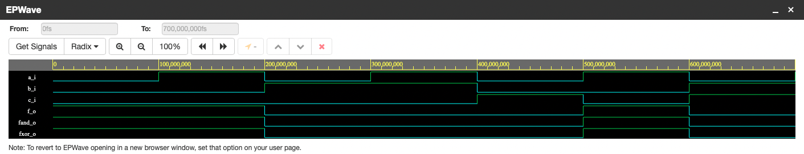

[GitHub link to repository:](https://github.com/jurekmartin3/Digital-electronics-1)


## Verification of De Morgan's laws

VHDL code of *design.hdl*


```vhdl
------------------------------------------------------------------------
--
-- Example of basic OR, AND, XOR gates.
-- Nexys A7-50T, Vivado v2020.1, EDA Playground
--
-- Copyright (c) 2019-2020 Tomas Fryza
-- Dept. of Radio Electronics, Brno University of Technology, Czechia
-- This work is licensed under the terms of the MIT license.
--
------------------------------------------------------------------------

library ieee;               -- Standard library
use ieee.std_logic_1164.all;-- Package for data types and logic operations

------------------------------------------------------------------------
-- Entity declaration for basic gates
------------------------------------------------------------------------
entity gates is
    port(
        a_i    : in  std_logic;         -- Data input
        b_i    : in  std_logic;         -- Data input
        c_i	   : in std_logic;			-- Data input
        f_o  : out std_logic;            -- OR output function
        fand_o : out std_logic;         -- AND output function
        fxor_o : out std_logic          -- XOR output function
    );
end entity gates;

------------------------------------------------------------------------
-- Architecture body for basic gates
------------------------------------------------------------------------
architecture dataflow of gates is
begin
    f_o  <= ((not b_i) and a_i) or ((not c_i) and (not b_i));
    fand_o <= not (not (not b_i and a_i) and not (not c_i and not b_i));
    fxor_o <= not (b_i or not a_i) or not (c_i or b_i);

end architecture dataflow;

```


