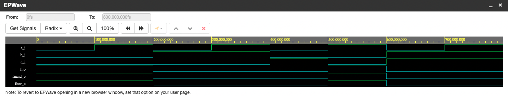
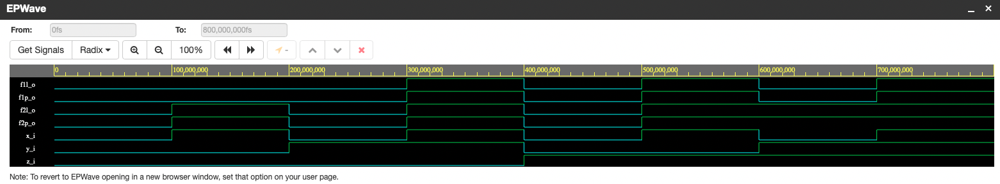

1. [GitHub link to repository:](https://github.com/jurekmartin3/Digital-electronics-1)
    
    https://github.com/jurekmartin3/Digital-electronics-1
2. Verification of De Morgan's laws of function f(c,b,a).

    - VHDL code of *design.hdl*


```vhdl
------------------------------------------------------------------------
--
-- Example of basic OR, AND, XOR gates.
-- Nexys A7-50T, Vivado v2020.1, EDA Playground
--
-- Copyright (c) 2019-2020 Tomas Fryza
-- Dept. of Radio Electronics, Brno University of Technology, Czechia
-- This work is licensed under the terms of the MIT license.
--
------------------------------------------------------------------------

library ieee;               -- Standard library
use ieee.std_logic_1164.all;-- Package for data types and logic operations

------------------------------------------------------------------------
-- Entity declaration for basic gates
------------------------------------------------------------------------
entity gates is
    port(
        a_i     : in  std_logic;        -- Data input
        b_i     : in  std_logic;        -- Data input
        c_i     : in std_logic;         -- Data input
        f_o     : out std_logic;        -- OR output function
        fnand_o : out std_logic;        -- NAND output function
        fnor_o  : out std_logic         -- NOR output function
    );
end entity gates;

------------------------------------------------------------------------
-- Architecture body for basic gates
------------------------------------------------------------------------
architecture dataflow of gates is
begin
    f_o       <= ((not b_i) and a_i) or ((not c_i) and (not b_i));
    fnand_o   <= ((not b_i nand a_i) nand  (not c_i nand not b_i));    
    fnor_o    <= not ((b_i nor not a_i) nor (c_i nor b_i));

end architecture dataflow;


```

- Screenshot with simulated time waveforms


[Link to EDA Playground – Verification of De Morgan's laws](https://www.edaplayground.com/x/7yEe)
    
    https://www.edaplayground.com/x/7yEe

3. Verification of Distributive laws.

    - VHDL code of *design.hdl*

```vhdl
------------------------------------------------------------------------
--
-- Example of basic OR, AND, XOR gates.
-- Nexys A7-50T, Vivado v2020.1, EDA Playground
--
-- Copyright (c) 2019-2020 Tomas Fryza
-- Dept. of Radio Electronics, Brno University of Technology, Czechia
-- This work is licensed under the terms of the MIT license.
--
------------------------------------------------------------------------

library ieee;               -- Standard library
use ieee.std_logic_1164.all;-- Package for data types and logic operations

------------------------------------------------------------------------
-- Entity declaration for basic gates
------------------------------------------------------------------------
entity gates is
    port(
        x_i    : in  std_logic;         -- Data input
        y_i    : in  std_logic;         -- Data input
        z_i    : in  std_logic;         -- Data input
        f1L_o  : out std_logic;         -- prvni funkce leva strana
        f1P_o  : out std_logic;         -- prvni funkce prava strana
        f2L_o  : out std_logic;         -- druha funkce leva strana
        f2P_o  : out std_logic          -- druha funkce prava strana
    );
end entity gates;

------------------------------------------------------------------------
-- Architecture body for basic gates
------------------------------------------------------------------------
architecture dataflow of gates is
begin
    f1L_o  <= (x_i and y_i) or (x_i and z_i);
    f1P_o  <= x_i and (y_i or z_i);
    f2L_o  <= (x_i or y_i) and (x_i or z_i);
    f2P_o  <= x_i or (y_i and z_i);

end architecture dataflow;

```
- Screenshot with simulated time waveforms


[Link to EDA Playground – Verification of Distributive laws](https://www.edaplayground.com/x/8PUv)
    
    https://www.edaplayground.com/x/8PUv
