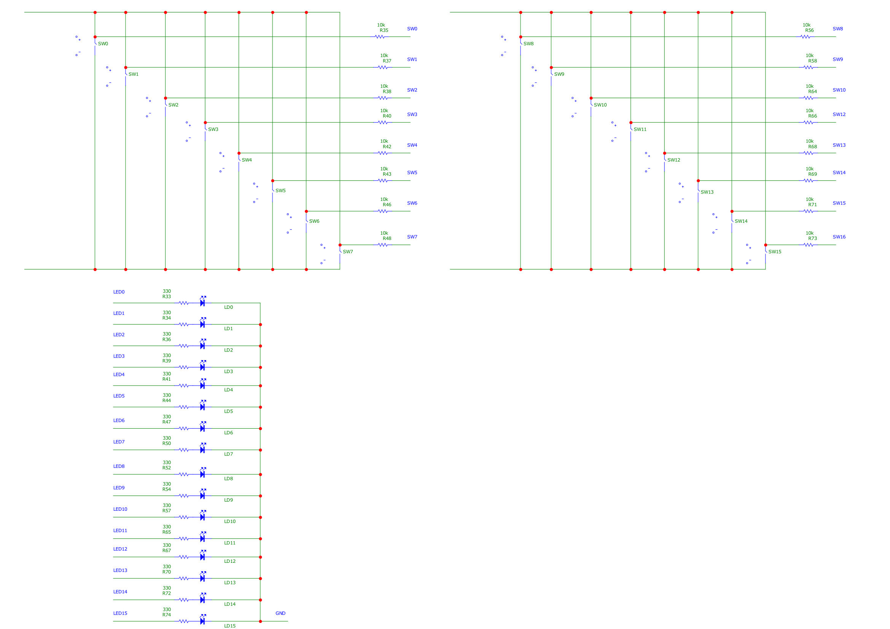
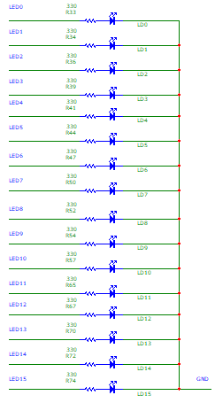
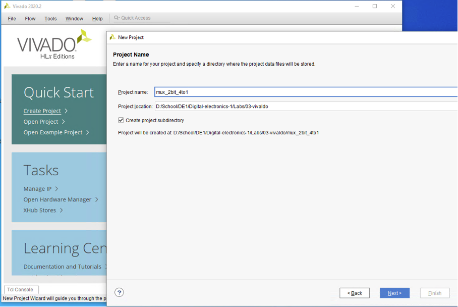
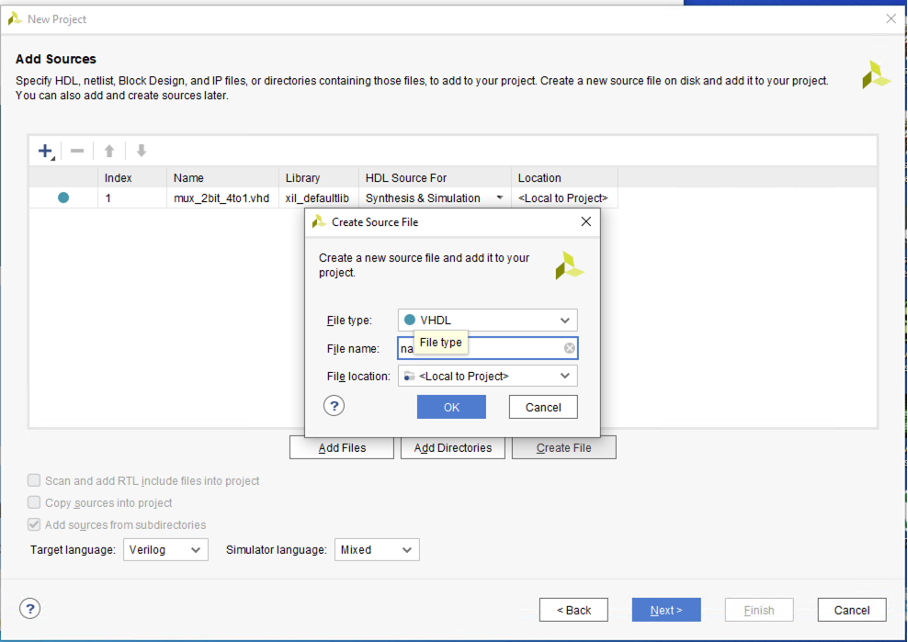
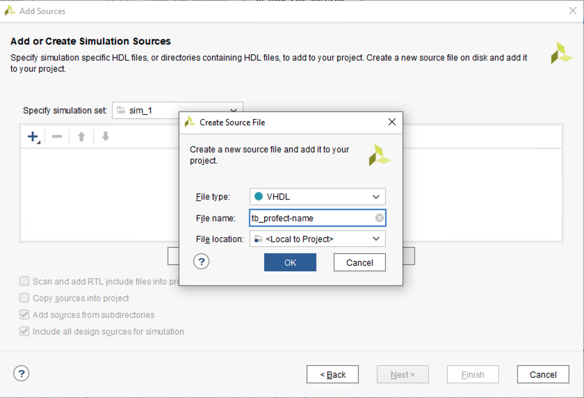
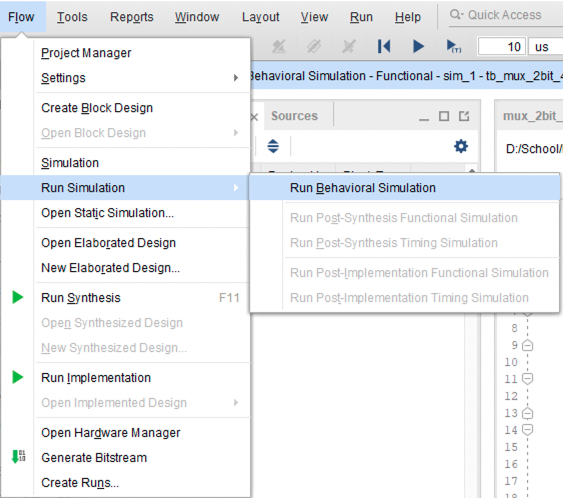

1. Preparation tasks.
   *Connection of 16 slide switches and 16 LEDs on Nexys A7 board.*
Schematics of 16 switches:  
   
   
   
   Schematics of 16 LEDs: 
   
   
2. Two-bit wide 4-to-1 multiplexer.
   Listing of VHDL architecture from source file `mux_2bit_4to1.vhd `:

   ```vhdl
   architecture Behavioral of mux_2bit_4to1 is
   begin  
       f_o <= a_i when (sel_i = "00") else
              b_i when (sel_i = "01") else
              c_i when (sel_i = "10") else
              d_i;
   ```

   Listing of VHDL stimulus process from testbench file `tb_mux_2bit_4to1.vhd`:

   ```vhdl
   p_stimulus : process
    begin
        -- Report a note at the begining of stimulus process
        report "Stimulus process started" severity note;
        
        s_d <= "11"; s_c <= "10"; s_b <= "01"; s_a <= "00";
        s_sel <= "11"; wait for 10 ns;
        
        s_d <= "11"; s_c <= "10"; s_b <= "01"; s_a <= "00";
        s_sel <= "10"; wait for 10 ns;
   
        s_d <= "11"; s_c <= "10"; s_b <= "01"; s_a <= "00";
        s_sel <= "10"; wait for 10 ns;
        
        s_d <= "11"; s_c <= "10"; s_b <= "01"; s_a <= "00";
        s_sel <= "01"; wait for 10 ns;
        
        s_d <= "11"; s_c <= "10"; s_b <= "01"; s_a <= "00";
        s_sel <= "11"; wait for 10 ns;
        
        s_d <= "11"; s_c <= "10"; s_b <= "01"; s_a <= "00";
        s_sel <= "00"; wait for 10 ns;
        
        s_d <= "00"; s_c <= "01"; s_b <= "10"; s_a <= "11";
        s_sel <= "00"; wait for 10 ns;
        
        s_d <= "00"; s_c <= "01"; s_b <= "10"; s_a <= "11";
        s_sel <= "11"; wait for 10 ns;
   
        s_d <= "00"; s_c <= "01"; s_b <= "10"; s_a <= "11";
        s_sel <= "10"; wait for 10 ns;
        
        s_d <= "00"; s_c <= "01"; s_b <= "10"; s_a <= "11";
        s_sel <= "10"; wait for 10 ns;
        
        s_d <= "00"; s_c <= "01"; s_b <= "10"; s_a <= "11";
        s_sel <= "01"; wait for 10 ns;
        
        s_d <= "00"; s_c <= "01"; s_b <= "10"; s_a <= "11";
        s_sel <= "11"; wait for 10 ns;
   
        report "Stimulus process finished" severity note;
        wait;
    end process p_stimulus;
   ```

3. A Vivado tutorial. 

   Creating a new project (File - New project):

   

   Then chose Project type *RTL project*. 

   Add source (Create File) and finish the creating process:

   

   Create testbench:

   ​	File - Add sources - Add or create simulation sources - Create File

   

   Run simulation:

   