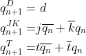
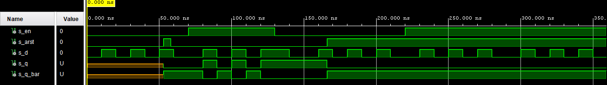
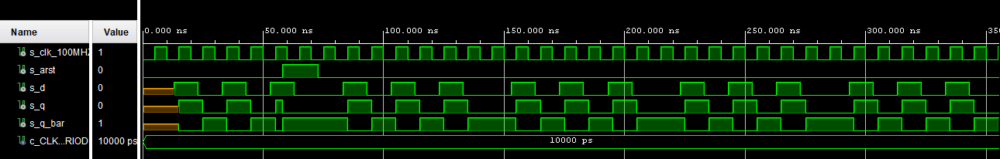
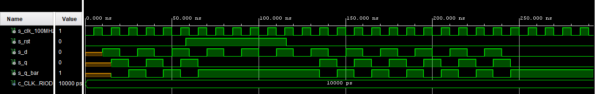
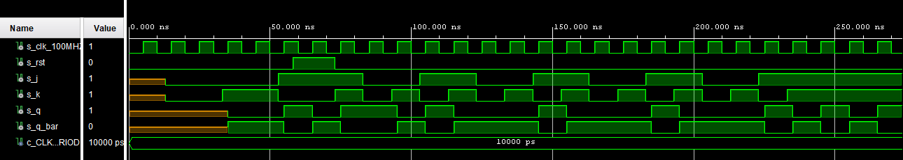
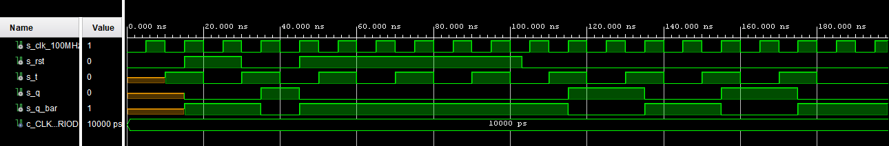

1. Preparation task: Characteristic equations and completed tables for D, JK, T flip-flops



| **clk** | **d** | **q(n)** | **q(n+1)** | **Comments** |
| :-: | :-: | :-: | :-: | :-- |
| ↑ | 0 | 0 | 0 | No change |
| ↑ | 0 | 1 | 0 | Reset |
| ↑ | 1 | 0 | 1 | No change |
| ↑ | 1 | 1 | 1 | Set |

| **clk** | **j** | **k** | **q(n)** | **q(n+1)** | **Comments** |
| :-: | :-: | :-: | :-: | :-: | :-- |
| ↑ | 0 | 0 | 0 | 0 | No change |
| ↑ | 0 | 0 | 1 | 1 | No change |
| ↑ | 0 | 1 | 0 | 0 | Reset |
| ↑ | 0 | 1 | 1 | 0 | Reset |
| ↑ | 1 | 0 | 0 | 1 | Set |
| ↑ | 1 | 0 | 1 | 1 | Set |
| ↑ | 1 | 1 | 0 | 1 | Toggle |
| ↑ | 1 | 1 | 1 | 0 | Toggle |

| **clk** | **t** | **q(n)** | **q(n+1)** | **Comments** |
| :-: | :-: | :-: | :-: | :-- |
| ↑ | 0 | 0 | 0 | No change |
| ↑ | 0 | 1 | 1 | No change |
| ↑ | 1 | 0 | 1 | Invert (toggle) |
| ↑ | 1 | 1 | 0 | Invert (toggle) |


2. D latch. Submit:
<<<<<<< HEAD
  * VHDL code listing of the process `p_d_latch` with syntax highlighting:
=======
	* VHDL code listing of the process `p_d_latch` with syntax highlighting:
>>>>>>> d79cf781859f4511ce70c7de40d1c5c0df2864bc
```vhdl
p_d_latch : process (d, arst, en)
    begin
        if (arst = '1') then
            q       <= '0';
            q_bar   <= '1';
        elsif (en = '1') then
            q       <= d;
            q_bar   <= not d;
        end if;
    end process p_d_latch;
```
* Listing of VHDL reset and stimulus processes from the testbench `tb_d_latch.vhd` file with syntax highlighting and asserts:
```vhdl
p_reset_gen : process
    begin
        s_arst <= '0';
        wait for 53 ns;
        
        -- Reset activated
        s_arst <= '1';
        wait for 5 ns;

        -- Reset deactivated
        s_arst <= '0';

        wait for 108 ns;
        s_arst <= '1';

        wait;
    end process p_reset_gen;
    
    p_stimulus : process
    begin
        report "Stimulus proces started" severity note;
        s_en <=  '0';
        s_d  <= '0';
        
        --d sequence
        wait for 10 ns;
        s_d  <= '1';
        wait for 10 ns;
        s_d  <= '0';
        wait for 10 ns;
        s_d  <= '1';
        wait for 10 ns;
        s_d  <= '0';
        wait for 10 ns;
        s_d  <= '1';
        wait for 10 ns;
        s_d  <= '0';
        wait for 10 ns;
        --/d sequence
        
        s_en <= '1';
        
        wait for 3 ns;
        assert(s_q = '0' and s_q_bar = '1')
        report "Failed at 73 ns" severity error;
        
        --d sequence
        wait for 7 ns;
        s_d  <= '1';
        wait for 10 ns;
        s_d  <= '0';
        wait for 10 ns;
        s_d  <= '1';
        wait for 10 ns;
        s_d  <= '0';
        wait for 10 ns;
        s_d  <= '1';
        wait for 10 ns;
        s_en <= '0';
        wait for 10 ns;
        s_d  <= '0';
        wait for 10 ns;
        --/d sequence
        
        --d sequence
        wait for 10 ns;
        s_d  <= '1';
        wait for 10 ns;
        s_d  <= '0';
        wait for 10 ns;
        s_d  <= '1';
        wait for 10 ns;
        s_d  <= '0';
        wait for 10 ns;
        s_d  <= '1';
        wait for 10 ns;
        s_d  <= '0';
        wait for 10 ns;
        --/d sequence
        
        s_en <= '1';
        
        --d sequence
        wait for 10 ns;
        s_d  <= '1';
        wait for 10 ns;
        s_d  <= '0';
        wait for 10 ns;
        s_d  <= '1';
        wait for 10 ns;
        s_d  <= '0';
        wait for 10 ns;
        s_d  <= '1';
        wait for 10 ns;
        s_d  <= '0';
        wait for 10 ns;
        --/d sequence
        
        --d sequence
        wait for 10 ns;
        s_d  <= '1';
        wait for 10 ns;
        s_d  <= '0';
        wait for 10 ns;
        s_d  <= '1';
        wait for 10 ns;
        s_d  <= '0';
        wait for 10 ns;
        s_d  <= '1';
        wait for 10 ns;
        s_d  <= '0';
        wait for 10 ns;
        --/d sequence

        report "Stimulus process finished" severity note;
        wait;
    end process p_stimulus;
```
* Screenshot with simulated time waveforms; always display all inputs and outputs. The full functionality of the entity must be verified.

3. Flip-flops. Submit:

<<<<<<< HEAD
  * VHDL code listing of the processes `p_d_ff_arst`, `p_d_ff_rst`, `p_jk_ff_rst`, `p_t_ff_rst` with syntax highlighting:
=======
	* VHDL code listing of the processes `p_d_ff_arst`, `p_d_ff_rst`, `p_jk_ff_rst`, `p_t_ff_rst` with syntax highlighting:
>>>>>>> d79cf781859f4511ce70c7de40d1c5c0df2864bc

`p_d_ff_arst`
```vhdl
p_d_ff_arst : process (clk, arst)
    begin
    if (arst = '1') then
        q       <= '0';
        q_bar   <= '1';
    elsif rising_edge(clk) then
        q       <= d;
        q_bar   <= not d;
    end if;
end process p_d_ff_arst;
```
`p_d_ff_rst`
```vhdl
p_d_ff_rst : process (clk)
    begin
        if rising_edge(clk) then
            if (rst = '1') then
                q     <= '0';
                q_bar <= '1';
            else
                q     <= d;
                q_bar <= not d;
            end if;
        end if;
        
    end process p_d_ff_rst;
```
`p_jk_ff_rst`
```vhdl
p_jk_ff_rst : process (clk)
    begin
        if rising_edge(clk) then
            if (rst = '1') then
                s_q <= '0';
            else    
                if (j = '0' and k = '0') then
                    s_q <= s_q;
                    
                elsif (j = '0' and k = '1') then
                    s_q <= '0';
                    
                elsif (j = '1' and k = '0') then
                    s_q <= '1';
                
                elsif (j = '1' and k = '1') then
                    s_q <= not s_q;
                    
                end if;
            end if;
        end if;
        
    end process p_jk_ff_rst;
    q       <= s_q;
    q_bar   <= not s_q;
```
`p_t_ff_rst`
```vhdl
p_t_ff_rst : process (clk)
    begin
        if rising_edge(clk) then
            if (rst = '1') then
                s_q <= '0';
            elsif (t = '1') then
                s_q <= not s_q;
            elsif (t = '0') then
                s_q <= s_q;
            end if;
        end if;
    end process p_t_ff_rst;
    q       <= s_q;
    q_bar   <= not s_q;
```
   * Listing of VHDL clock, reset and stimulus processes from the testbench files with syntax highlighting and asserts:
`tb_d_ff_arst`
```vhdl
p_clk_gen : process
    begin
        while now < 750 ns loop         -- 75 periods of 100MHz clock
            s_clk_100MHz <= '0';
            wait for c_CLK_100MHZ_PERIOD / 2;
            s_clk_100MHz <= '1';
            wait for c_CLK_100MHZ_PERIOD / 2;
        end loop;
        wait;
    end process p_clk_gen;

    p_reset_gen : process
    begin
        s_arst <= '0';
        wait for 58 ns;
        
        -- Reset activated
        s_arst <= '1';
        wait for 15 ns;

        -- Reset deactivated
        s_arst <= '0';

        wait;
    end process p_reset_gen;


    p_stimulus : process
    begin
        report "Stimulus process started" severity note;
        
        --d sequence
        wait for 13 ns;
        s_d  <= '1';
        wait for 10 ns;
        s_d  <= '0';
        wait for 10 ns;
        s_d  <= '1';
        wait for 10 ns;
        s_d  <= '0';
        wait for 10 ns;
        s_d  <= '1';
        wait for 10 ns;
        s_d  <= '0';
        wait for 10 ns;
        --/d sequence
                
        wait for 3 ns;
        assert(s_q = '0' and s_q_bar = '1')
        report "Failed at 73 ns" severity error;
        
        --d sequence
        wait for 7 ns;
        s_d  <= '1';
        wait for 10 ns;
        s_d  <= '0';
        wait for 10 ns;
        s_d  <= '1';
        wait for 10 ns;
        s_d  <= '0';
        wait for 10 ns;
        s_d  <= '1';
        wait for 10 ns;
        s_d  <= '0';
        wait for 10 ns;
        --/d sequence
        
        --d sequence
        wait for 10 ns;
        s_d  <= '1';
        wait for 10 ns;
        s_d  <= '0';
        wait for 10 ns;
        s_d  <= '1';
        wait for 10 ns;
        s_d  <= '0';
        wait for 10 ns;
        s_d  <= '1';
        wait for 10 ns;
        s_d  <= '0';
        wait for 10 ns;
        --/d sequence
        
        --d sequence
        wait for 10 ns;
        s_d  <= '1';
        wait for 10 ns;
        s_d  <= '0';
        wait for 10 ns;
        s_d  <= '1';
        wait for 10 ns;
        s_d  <= '0';
        wait for 10 ns;
        s_d  <= '1';
        wait for 10 ns;
        s_d  <= '0';
        wait for 10 ns;
        --/d sequence
        
        --d sequence
        wait for 10 ns;
        s_d  <= '1';
        wait for 10 ns;
        s_d  <= '0';
        wait for 10 ns;
        s_d  <= '1';
        wait for 10 ns;
        s_d  <= '0';
        wait for 10 ns;
        s_d  <= '1';
        wait for 10 ns;
        s_d  <= '0';
        wait for 10 ns;
        --/d sequence

        report "Stimulus process finished" severity note;
        wait;
    end process p_stimulus;
```
`tb_d_ff_rst`
```vhdl
p_clk_gen : process
    begin
        while now < 750 ns loop         -- 75 periods of 100MHz clock
            s_clk_100MHz <= '0';
            wait for c_CLK_100MHZ_PERIOD / 2;
            s_clk_100MHz <= '1';
            wait for c_CLK_100MHZ_PERIOD / 2;
        end loop;
        wait;
    end process p_clk_gen;

    p_reset_gen : process
    begin
        s_rst <= '0';
        wait for 58 ns;
        
        -- Reset activated
        s_rst <= '1';
        wait for 58 ns;
        
        -- Reset deactivated
        s_rst <= '0';
        
        wait;
    end process p_reset_gen;

     p_stimulus : process
     begin
        report "Stimulus process started" severity note;
        
         -- d sekv
        wait for 10 ns;
        s_d   <= '1';
        wait for 10 ns;
        s_d   <= '0';
        wait for 10 ns;
        s_d   <= '1';
        
        wait for 5 ns;
        -- Expected output
        assert ((s_q = '0') and (s_q_bar = '1'))
        -- If false, then report an error
        report "Test failed for input on 35ns" severity error;

        wait for 5 ns;
        s_d   <= '0';
        wait for 10 ns;
        s_d   <= '1';
        wait for 10 ns;
        s_d   <= '0';
        --/d sekv
        
        -- d sekv
        wait for 10 ns;
        s_d   <= '1';
        
        assert ((s_q = '0') and (s_q_bar = '1'))
        -- If false, then report an error
        report "Test failed for input on 70ns" severity error;
        
        wait for 10 ns;
        s_d   <= '0';
        wait for 10 ns;
        s_d   <= '1';
        wait for 10 ns;
        s_d   <= '0';     
        wait for 10 ns;
        s_d   <= '1';      
        wait for 10 ns;
        s_d   <= '0';
        --/d sekv
        
        -- d sekv
        wait for 10 ns;
        s_d   <= '1';
        wait for 10 ns;
        s_d   <= '0';
        wait for 10 ns;
        s_d   <= '1';
        wait for 10 ns;
        s_d   <= '0';
        wait for 10 ns;
        s_d   <= '1';
        wait for 10 ns;
        s_d   <= '0';
        --/d sekv
        
        -- d sekv
        wait for 10 ns;
        s_d   <= '1';
        wait for 10 ns;
        s_d   <= '0';
        wait for 10 ns;
        s_d   <= '1';
        wait for 10 ns;
        s_d   <= '0';
        wait for 10 ns;
        s_d   <= '1';
        wait for 10 ns;
        s_d   <= '0';
        --/d sekv
                
        report "Stimulus process finished" severity note;
        wait;
     end process p_stimulus;
```
`tb_jk_ff_rst`
```vhdl
p_clk_gen : process
    begin
        while now < 750 ns loop         -- 75 periods of 100MHz clock
            s_clk_100MHz <= '0';
            wait for c_CLK_100MHZ_PERIOD / 2;
            s_clk_100MHz <= '1';
            wait for c_CLK_100MHZ_PERIOD / 2;
        end loop;
        wait;
    end process p_clk_gen;
    
    p_reset_gen : process
    begin
        s_rst <= '0';
        wait for 58 ns;
        
        -- Reset activated
        s_rst <= '1';
        wait for 15 ns;

        -- Reset deactivated
        s_rst <= '0';

        wait;
    end process p_reset_gen;
    
    
    p_stimulus : process
    begin
        report "Stimulus process started" severity note;
        
        wait for 13 ns;
        s_j <= '0';
        s_k <= '0';
        wait for 20 ns;
        s_j <= '0';
        s_k <= '1';
        
        wait for 5 ns;
        assert ((s_q = '0') and (s_q_bar = '1'))
        -- If false, then report an error
        report "Test failed for input on 38ns" severity error;
        
        wait for 15 ns;
        s_j <= '1';
        s_k <= '0';
        
        wait for 10 ns;
        assert ((s_q = '0') and (s_q_bar = '1'))
        -- If false, then report an error
        report "Test failed for input on 63ns" severity error;
        
        wait for 10 ns;
        s_j <= '1';
        s_k <= '1';
        
        
        wait for 10 ns;
        s_j  <= '0';
        s_k  <= '0';
        wait for 10 ns;
        s_j  <= '0';
        s_k  <= '1';
        wait for 10 ns;
        s_j  <= '1';
        s_k  <= '0';
        wait for 10 ns;
        s_j  <= '1';
        s_k  <= '1';

        wait for 10 ns;
        s_j  <= '0';
        s_k  <= '0';
        wait for 10 ns;
        s_j  <= '0';
        s_k  <= '1';
        wait for 10 ns;
        s_j  <= '1';
        s_k  <= '0';
        wait for 10 ns;
        s_j  <= '1';
        s_k  <= '1';
        
        wait for 10 ns;
        s_j  <= '0';
        s_k  <= '0';
        wait for 10 ns;
        s_j  <= '0';
        s_k  <= '1';
        wait for 10 ns;
        s_j  <= '1';
        s_k  <= '0';
        wait for 10 ns;
        s_j  <= '1';
        s_k  <= '1';
        
        wait for 10 ns;
        s_j  <= '0';
        s_k  <= '0';
        wait for 10 ns;
        s_j  <= '0';
        s_k  <= '1';
        wait for 10 ns;
        s_j  <= '1';
        s_k  <= '0';
        wait for 10 ns;
        s_j  <= '1';
        s_k  <= '1';

        report "Stimulus process finished" severity note;
        wait;
    end process p_stimulus;
```
`tb_t_ff_rst`
```vhdl
p_clk_gen : process
    begin
        while now < 750 ns loop         -- 75 periods of 100MHz clock
            s_clk_100MHz <= '0';
            wait for c_CLK_100MHZ_PERIOD / 2;
            s_clk_100MHz <= '1';
            wait for c_CLK_100MHZ_PERIOD / 2;
        end loop;
        wait;
    end process p_clk_gen;

    p_reset_gen : process
    begin
        s_rst <= '0';
        wait for 15 ns;
        
        s_rst <= '1';
        wait for 15 ns;
        
        s_rst <= '0';
        wait for 15 ns;
        
        s_rst <= '1';
        wait for 58 ns;
        
        s_rst <= '0';
        wait;
    end process p_reset_gen;

     p_stimulus : process
     begin
        report "Stimulus process started" severity note;
    
        -- t sekv
        wait for 10 ns;
        s_t   <= '1';
        wait for 10 ns;
        s_t   <= '0';
        wait for 10 ns;
        s_t   <= '1';
        wait for 10 ns;
        s_t   <= '0';
        wait for 10 ns;
        s_t   <= '1';
        wait for 10 ns;
        s_t   <= '0';
        -- t sekv
        
        assert ((s_q = '0') and (s_q_bar = '1'))
        -- If false, then report an error
        report "Test failed for input on 60ns" severity error; 
         
        -- t sekv
        wait for 10 ns;
        s_t   <= '1';
        wait for 10 ns;
        s_t   <= '0';
        wait for 10 ns;
        s_t   <= '1';
        wait for 10 ns;
        s_t   <= '0';
        wait for 10 ns;
        s_t   <= '1';
        wait for 10 ns;
        s_t   <= '0';
        -- t sekv
         
        -- Expected output
        assert ((s_q = '1') and (s_q_bar = '0'))
        -- If false, then report an error
        report "Test failed for input on 120ns" severity error;
        
        -- t sekv
        wait for 10 ns;
        s_t   <= '1';
        wait for 10 ns;
        s_t   <= '0';
        wait for 10 ns;
        s_t   <= '1';
        wait for 10 ns;
        s_t   <= '0';
        wait for 10 ns;
        s_t   <= '1';
        wait for 10 ns;
        s_t   <= '0';
        -- t sekv
        
        report "Stimulus process finished" severity note;
        wait;
     end process p_stimulus;
```
   * Screenshot with simulated time waveforms; always display all inputs and outputs. The full functionality of the entities must be verified.
`d_ff_arst`

`d_ff_rst`

`jk_ff_rst`

`t_ff_rst`

4. Shift register. Submit:
   
   * Image of the shift register schematic. The image can be drawn on a computer or by hand. Name all inputs, outputs, components and internal signals.