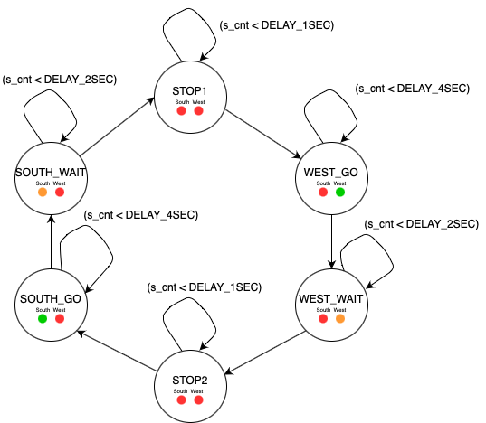
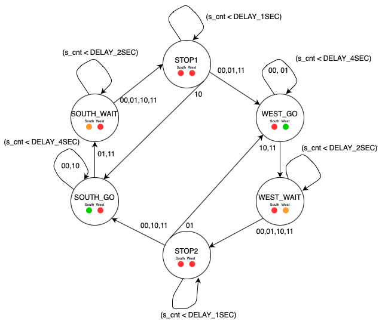

1. Preparation tasks
   * Completed state table:

| **Input P**  | `0`  | `0`  | `1`  | `1`  | `0`  | `1`  | `0`  | `1`  | `1`  | `1`  | `1`  | `0`  | `0`  | `1`  | `1`  | `1`  |
| :----------- | :--: | :--: | :--: | :--: | :--: | :--: | :--: | :--: | :--: | :--: | :--: | :--: | :--: | :--: | :--: | :--: |
| **Clock**    |  ↑   |  ↑   |  ↑   |  ↑   |  ↑   |  ↑   |  ↑   |  ↑   |  ↑   |  ↑   |  ↑   |  ↑   |  ↑   |  ↑   |  ↑   |  ↑   |
| **State**    |  A   |  A   |  B   |  C   |  C   |  D   |  A   |  B   |  C   |  D   |  B   |  B   |  B   |  C   |  D   |  B   |
| **Output R** | `0`  | `0`  | `0`  | `0`  | `0`  | `1`  | `0`  | `0`  | `0`  | `1`  | `0`  | `0`  | `0`  | `0`  | `1`  | `0`  |
   * Figure with connection of RGB LEDs on Nexys A7 board and completed table with color settings:


| **RGB LED** | **Artix-7 pin names** | **Red** | **Yellow** | **Green** |
| :---------: | :-------------------: | :-----: | :--------: | :-------: |
|    LD16     |     N15, M16, R12     | `1,0,0` |  `1,1,0`   |  `0,1,0`  |
|    LD17     |     N16, R11, G14     | `1,0,0` |  `1,1,0`   |  `0,1,0`  |

2. Traffic light controller. Submit:

   * State diagram:
   
   
   * Listing of VHDL code of sequential process `p_traffic_fsm` with syntax highlighting:
   
```vhdl
p_traffic_fsm : process(clk)
    begin
        if rising_edge(clk) then
            if (reset = '1') then       -- Synchronous reset
                s_state <= STOP1 ;      -- Set initial state
                s_cnt   <= c_ZERO;      -- Clear all bits

            elsif (s_en = '1') then
                -- Every 250 ms, CASE checks the value of the s_state 
                -- variable and changes to the next state according 
                -- to the delay value.
                case s_state is

                    -- If the current state is STOP1, then wait 1 sec
                    -- and move to the next GO_WAIT state.
                    when STOP1 =>
                        -- Count up to c_DELAY_1SEC
                        if (s_cnt < c_DELAY_1SEC) then
                            s_cnt <= s_cnt + 1;
                        else
                            -- Move to the next state
                            s_state <= WEST_GO;
                            -- Reset local counter value
                            s_cnt   <= c_ZERO;
                        end if;

                    when WEST_GO =>
                        -- Count up to c_DELAY_1SEC
                        if (s_cnt < c_DELAY_4SEC) then
                            s_cnt <= s_cnt + 1;
                        else
                            -- Move to the next state
                            s_state <= WEST_WAIT;
                            -- Reset local counter value
                            s_cnt   <= c_ZERO;
                        end if;
                    
                    when WEST_WAIT =>
                        -- Count up to c_DELAY_1SEC
                        if (s_cnt < c_DELAY_2SEC) then
                            s_cnt <= s_cnt + 1;
                        else
                            -- Move to the next state
                            s_state <= STOP2;
                            -- Reset local counter value
                            s_cnt   <= c_ZERO;
                        end if;
                        
                    when STOP2 =>
                        -- Count up to c_DELAY_1SEC
                        if (s_cnt < c_DELAY_1SEC) then
                            s_cnt <= s_cnt + 1;
                        else
                            -- Move to the next state
                            s_state <= SOUTH_GO;
                            -- Reset local counter value
                            s_cnt   <= c_ZERO;
                        end if;
                        
                    when SOUTH_GO =>
                        -- Count up to c_DELAY_1SEC
                        if (s_cnt < c_DELAY_4SEC) then
                            s_cnt <= s_cnt + 1;
                        else
                            -- Move to the next state
                            s_state <= SOUTH_WAIT;
                            -- Reset local counter value
                            s_cnt   <= c_ZERO;
                        end if;
                        
                    when SOUTH_WAIT =>
                        -- Count up to c_DELAY_1SEC
                        if (s_cnt < c_DELAY_2SEC) then
                            s_cnt <= s_cnt + 1;
                        else
                            -- Move to the next state
                            s_state <= STOP1;
                            -- Reset local counter value
                            s_cnt   <= c_ZERO;
                        end if;
                    -- It is a good programming practice to use the 
                    -- OTHERS clause, even if all CASE choices have 
                    -- been made. 
                    when others =>
                        s_state <= STOP1;
                end case;
            end if; -- Synchronous reset
        end if; -- Rising edge
    end process p_traffic_fsm;
```
   * Listing of VHDL code of combinatorial process `p_output_fsm` with syntax highlighting:
```vhdl
   p_output_fsm : process(s_state)
    begin
        case s_state is
            when STOP1 =>
                south_o <= "100";   -- Red (RGB = 100)
                west_o  <= "100";   -- Red (RGB = 100)
            when WEST_GO =>
                south_o <= "100";   -- Red (RGB = 100)
                west_o  <= "010";   -- Green (RGB = 010)
            when WEST_WAIT =>
                south_o <= "100";   -- Red (RGB = 100)
                west_o  <= "110";   -- Yellow (RGB = 110)
            when STOP2 =>
                south_o <= "100";   -- Red (RGB = 100)
                west_o  <= "100";   -- Red (RGB = 100)
            when SOUTH_GO =>
                south_o <= "010";   -- Green (RGB = 010)
                west_o  <= "100";   -- Red (RGB = 100)
            when SOUTH_WAIT =>
                south_o <= "110";   -- Yellow (RGB = 110)
                west_o  <= "100";   -- Red (RGB = 100)
            when others =>
                south_o <= "100";   -- Red (RGB = 100)
                west_o  <= "100";   -- Red (RGB = 100)
        end case;
    end process p_output_fsm;
```
   * Screenshot(s) of the simulation, from which it is clear that controller works correctly:


​	*Detail of the simulation:*


3. Smart controller:
    * State table:
    
    <table class="tg">
    <thead>
      <tr>
        <th class="tg-c3ow" rowspan="3">Current<br>state</th>
        <th class="tg-c3ow" colspan="3">Output</th>
        <th class="tg-c3ow" colspan="4">Next state</th>
      </tr>
      <tr>
        <td class="tg-c3ow" rowspan="2">South Direction</td>
        <td class="tg-0pky" rowspan="2">West Direction</td>
        <td class="tg-0pky" rowspan="2">Delay</td>
        <td class="tg-0pky">No cars</td>
        <td class="tg-0pky">Cars to West</td>
        <td class="tg-0pky">Cars to South</td>
        <td class="tg-0pky">Cars Both Directions</td>
      </tr>
      <tr>
        <td class="tg-0pky">00</td>
        <td class="tg-0pky">01</td>
        <td class="tg-0pky">10</td>
        <td class="tg-0pky">11</td>
      </tr>
    </thead>
    <tbody>
      <tr>
        <td class="tg-0pky">STOP1</td>
        <td class="tg-0pky">red</td>
        <td class="tg-0pky">red</td>
        <td class="tg-0pky">1 sec</td>
        <td class="tg-0pky">WEST_GO</td>
        <td class="tg-0pky">WEST_GO</td>
        <td class="tg-0pky">SOUTH_GO</td>
        <td class="tg-0pky">WEST_GO</td>
      </tr>
      <tr>
        <td class="tg-0pky">WEST_GO</td>
        <td class="tg-0pky">red</td>
        <td class="tg-0pky">green</td>
        <td class="tg-0pky">4 sec</td>
        <td class="tg-0pky">WEST_GO</td>
        <td class="tg-0pky">WEST_GO</td>
        <td class="tg-0pky">WEST_WAIT</td>
        <td class="tg-0pky">WEST_WAIT</td>
      </tr>
      <tr>
        <td class="tg-0pky">WEST_WAIT</td>
        <td class="tg-0pky">red</td>
        <td class="tg-0pky">yellow</td>
        <td class="tg-0pky">2 sec</td>
        <td class="tg-0pky">STOP2</td>
        <td class="tg-0pky">STOP2</td>
        <td class="tg-0pky">STOP2</td>
        <td class="tg-0pky">STOP2</td>
      </tr>
      <tr>
        <td class="tg-0pky">STOP2</td>
        <td class="tg-0pky">red</td>
        <td class="tg-0pky">red</td>
        <td class="tg-0pky">1 sec</td>
        <td class="tg-0pky">SOUTH_GO</td>
        <td class="tg-0pky">WEST_GO</td>
        <td class="tg-0pky">SOUTH_GO</td>
        <td class="tg-0pky">SOUTH_GO</td>
      </tr>
      <tr>
        <td class="tg-0pky">SOUTH_GO</td>
        <td class="tg-0pky">green</td>
        <td class="tg-0pky">red</td>
        <td class="tg-0pky">4 sec</td>
        <td class="tg-0pky">SOUTH_GO</td>
        <td class="tg-0pky">SOUTH_WAIT</td>
        <td class="tg-0pky">SOUTH_GO</td>
        <td class="tg-0pky">SOUTH_WAIT</td>
      </tr>
      <tr>
        <td class="tg-0pky">SOUTH_WAIT</td>
        <td class="tg-0pky">yellow</td>
        <td class="tg-0pky">red</td>
        <td class="tg-0pky">2 sec</td>
        <td class="tg-0pky">STOP1</td>
        <td class="tg-0pky">STOP1</td>
        <td class="tg-0pky">STOP1</td>
        <td class="tg-0pky">STOP1</td>
      </tr>
    </tbody>
    </table>
    
    * State diagram



   * Listing of VHDL code of sequential process `p_smart_traffic_fsm` with syntax highlighting:
```vhdl
p_smart_traffic_fsm : process(clk)
    begin
        if rising_edge(clk) then
            if (reset = '1') then       -- Synchronous reset
                s_state <= STOP1 ;      -- Set initial state
                s_cnt   <= c_ZERO;      -- Clear all bits

            elsif (s_en = '1') then
                -- Every 250 ms, CASE checks the value of the s_state 
                -- variable and changes to the next state according 
                -- to the delay value.
                case s_state is

                    -- If the current state is STOP1, then wait 1 sec
                    -- and move to the next GO_WAIT state.
                    when STOP1 =>
                        -- Count up to c_DELAY_1SEC
                        if (s_cnt < c_DELAY_1SEC) then
                            s_cnt <= s_cnt + 1;
                        else
                            if (sensor = "10") then
                                -- Skip to the SOUTH_GO state
                                s_state <= SOUTH_GO;
                                -- Reset local counter value
                                s_cnt   <= c_ZERO;
                            else
                                -- Move to the next state
                                s_state <= WEST_GO;
                                -- Reset local counter value
                                s_cnt   <= c_ZERO;
                            end if;
                        end if;

                    when WEST_GO =>
                        -- Count up to c_DELAY_1SEC
                        if (s_cnt < c_DELAY_4SEC) then
                            s_cnt <= s_cnt + 1;
                        else
                            if (sensor = "00" or sensor = "01") then
                                -- Stay on the same state
                                s_state <= WEST_GO;
                                -- Reset local counter value
                                s_cnt   <= c_ZERO;
                            else
                                -- Move to the next state
                                s_state <= WEST_WAIT;
                                -- Reset local counter value
                                s_cnt   <= c_ZERO;
                            end if;
                        end if;

                    when WEST_WAIT =>
                        -- Count up to c_DELAY_1SEC
                        if (s_cnt < c_DELAY_2SEC) then
                            s_cnt <= s_cnt + 1;
                        else
                            -- Move to the next state
                            s_state <= STOP2;
                            -- Reset local counter value
                            s_cnt   <= c_ZERO;
                        end if;
                        
                    when STOP2 =>
                        -- Count up to c_DELAY_1SEC
                        if (s_cnt < c_DELAY_1SEC) then
                            s_cnt <= s_cnt + 1;
                        else
                            if (sensor = "01") then
                                s_state <= WEST_GO;
                                -- Reset local counter value
                                s_cnt   <= c_ZERO;
                            else
                                -- Move to the next state
                                s_state <= SOUTH_GO;
                                -- Reset local counter value
                                s_cnt   <= c_ZERO;
                            end if;
                        end if;
                        
                    when SOUTH_GO =>
                        -- Count up to c_DELAY_1SEC
                        if (s_cnt < c_DELAY_4SEC) then
                            s_cnt <= s_cnt + 1;
                        else
                            if (sensor = "00" or sensor = "10") then
                                s_state <= SOUTH_GO;
                                -- Reset local counter value
                                s_cnt   <= c_ZERO;
                            else
                                -- Move to the next state
                                s_state <= SOUTH_WAIT;
                                -- Reset local counter value
                                s_cnt   <= c_ZERO;
                            end if;
                        end if;
                        
                     when SOUTH_WAIT =>
                        -- Count up to c_DELAY_1SEC
                        if (s_cnt < c_DELAY_2SEC) then
                            s_cnt <= s_cnt + 1;
                        else
                            -- Move to the next state
                            s_state <= STOP1;
                            -- Reset local counter value
                            s_cnt   <= c_ZERO;
                        end if; 
                      when others =>
                          s_state <= STOP1;

                end case;
            end if; -- Synchronous reset
        end if; -- Rising edge
    end process p_smart_traffic_fsm;
```