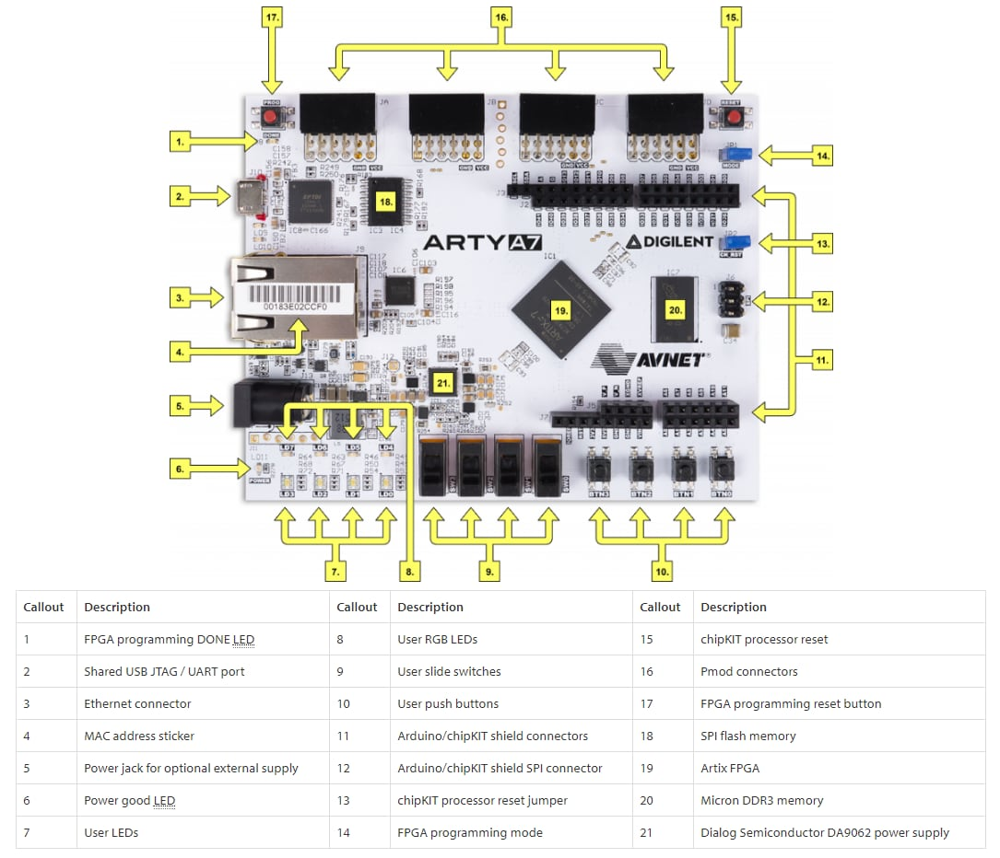
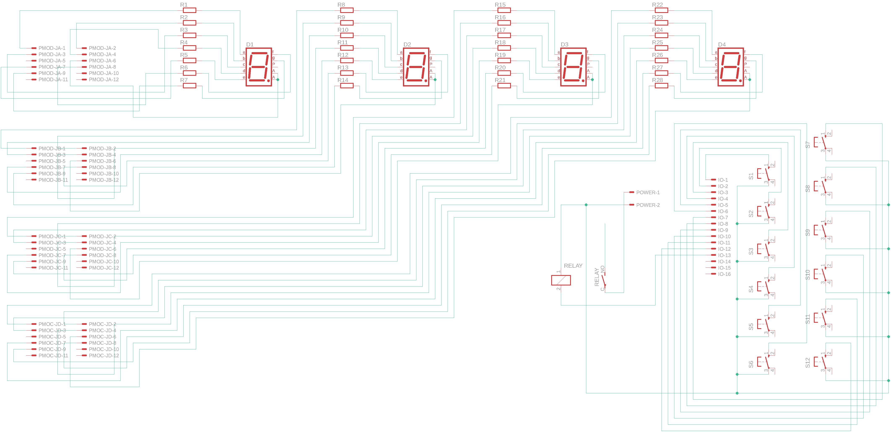
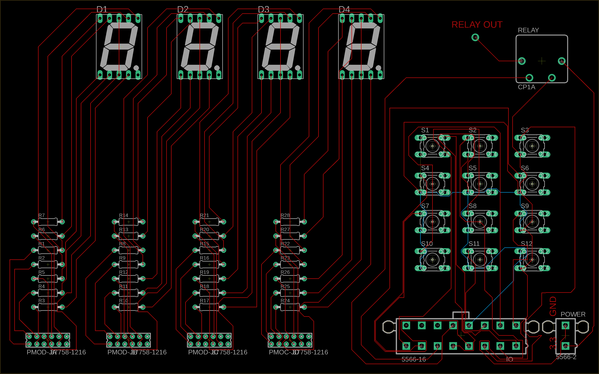
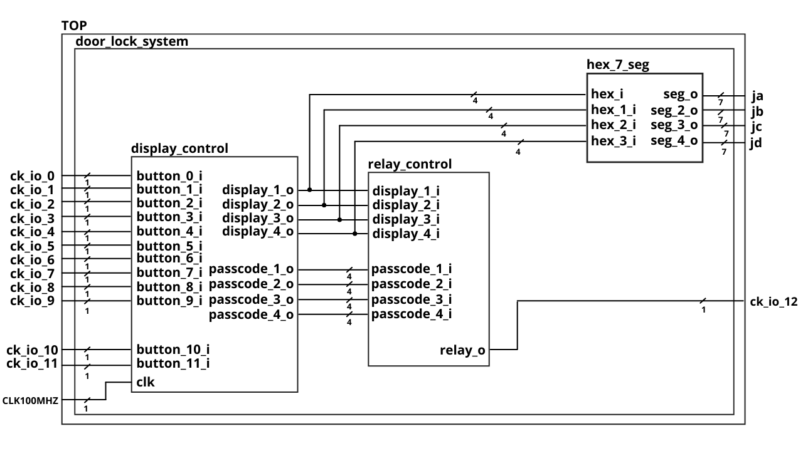
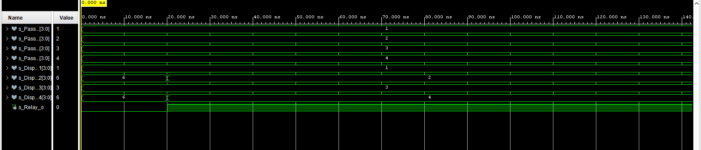
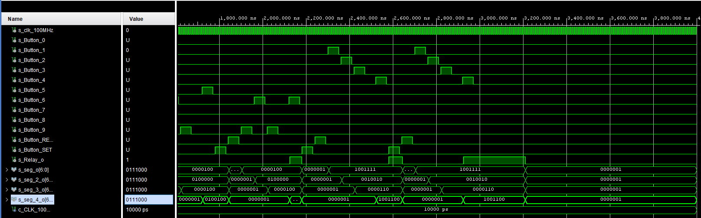

# Systém zámku dveří

## Členové týmu
Jurek Martin, Kadlec Jiří, Kislerová Helena, Kovaříková Hana, Kratochvil Tomáš.

[https://github.com/Krakenuz/Digital-electronics-1-Project](https://github.com/Krakenuz/Digital-electronics-1-Project)

## Zadání projektu
- Cílem projektu bylo vytvořit systém, který nám umožní zamykání a odemykání dveří pomocí pomocí 4-místného PIN kódu. V zadání bylo uvedené, že při zpracování tohoto projektu máme použít 4x3 tlačítek, čtyři 7-segmentové displaye a relé, kterým budeme ovládat zámek dveří. 

## Popis hardwaru
#### Vývojová deska :
- Jako vývojovou desku jsme zvolili Arty A7-100T.  
- Využili jsme porty ck_io0-ck_io11 jako vstup a porty ja0-ja6, jb0-jb6, jc0-jc6, jd0-jd6 a ck_io12 jako výstup.




<table>
<tr><th> VSTUPY </th><th> VYSTUPY </th></tr>
<tr><td>

| Port | TOP vstup |
|  :-: | :-: |
| ck_io0 | button_0_i |
| ck_io1 | button_1_i |
| ck_io2 | button_2_i |
| ck_io3 | button_3_i |
| ck_io4 | button_4_i |
| ck_io5 | button_5_i |
| ck_io6 | button_6_i |
| ck_io7 | button_7_i |
| ck_io8 | button_8_i |
| ck_io9 | button_9_i |
| ck_io10 | button_reset_i |
| ck_io11 | button_set_i |
| CLK100MHZ | clk |
</td><td>

| Port | TOP výstup |
|  :-: | :-: |
| seg_o | ja|
| seg_2_o | jb |
| seg_3_o | jc |
| seg_4_o | jd|
| relay_0 | ck_io12 |

</td></tr> </table>

#### Tlačítka :
| Hodnota proměnné | ID tlačítka |
|  :-: | :-: |
| 000000000001 | button_0_i |
| 000000000010 | button_1_i |
| 000000000100 | button_2_i |
| 000000001000 | button_3_i |
| 000000010000 | button_4_i |
| 000000100000 | button_5_i |
| 000001000000 | button_6_i |
| 000010000000 | button_7_i |
| 000100000000 | button_8_i |
| 001000000000 | button_9_i |
| 010000000000 | button_reset_i |
| 100000000000 | button_set_i |

#### Displaye (hex_7seg) :
| Hodnota proměnné | Display zobrazí |
|  :-: | :-: |
| 0000 | 0 |
| 0001 | 1 |
| 0010 | 2 |
| 0011 | 3 |
| 0100 | 4 |
| 0101 | 5 |
| 0110 | 6 |
| 0111 | 7 |
| 1000 | 8 |
| 1001 | 9 |

Relé :
| VSTUP | AKCE|
|  :-: | :-: |
| 0 | ROZEPNUTO |
| 1 | SEPNUTO |

## Popis projektu
- Deska reaguje na stisknutí tlačítek. Při prvím stisknutí tlačítka se nastavuje číselná hodnota na první displej, při následujícím stisknutí se nastavuje hodnota na druhý displej a stejně tak u následujících dvou displejů. Pokud jsme se překlepli pří zadávání hesla, použijeme tlačítko RESET, které slouží k vynulování všech 4 displejů najednou.
- První nastavení hesla se provádí zadáním 4 číslic a následným stiskem tlačítka SET. Následně se změna hesla provádí takto: zadáme staré hesla na displej, stiskneme SET, zadáme nové heslo a následně stiskneme zase SET. Tímto jsme nastavili nové heslo. 
- Když se zadá 4 místné heslo na displej, tak se sepne relé (Odemknou dveře). 
- Další funkcí je automatické nulování displeje po časovém intervalu. Takže například po otevření dveří se displej automaticky za X sekund vynuluje.  
- Při tvorbě jsme použili modul HEX7SEG ze cvičení 4.

## Plošný spoj a jeho schéma
- Pro tento projekt bylo zapotřebí použít prvky, kterými samotná vývojová deska nedisponuje. Proto bylo nutné navrhnout desku, která nám poskytne požadovanou funkcionalitu. Jako vstup máme připojeno 12 tlačítek a relé na IO piny, dále máme na Pmod přivedeny 4 sedmi-segmentové displeje. Níže se nachází navržené schéma a samotná PCB deska vytvořená v programu Autodesk EAGLE. 






## Schéma zapojení modulů


## VHDL moduly
### Princip `relay_control`
- Tento modul slouží k ověření zadaného hesla.Pokud zadané heslo souhlasí, sepne se relé a otevře se zámek.
```vhdl 
	--Relay Control
    --Activates the relay if displayed numbers on numbers = PASSCODE
    if (s_internal2_Display_1 = s_internal2_Passcode_1 and s_internal2_Display_2 = s_internal2_Passcode_2 and s_internal2_Display_3 = s_internal2_Passcode_3 and s_internal2_Display_4 = s_internal2_Passcode_4) then
               Relay_o <= '1';
            else
                Relay_o <= '0';
            end if;     
```

### Princip `hex_7seg`
- Modul hex_7seg je rozšířená verze modulu stejného jména, jež byl součástí několika laboratorních cvičení, viz reference. Slouží k překladu čtyřbitového binárního kódu na sedmibitový binární kód, jehož jedničky představují sepnuté segmenty displeje.
```vhdl
	-- Translates binary signal (0000 = number 0) to input for 7segment display   
	case s_internal2_Display_1 is
            when "0000" =>
                seg_o <= "0000001";     --0
            when "0001" =>
                seg_o <= "1001111";     --1
            when "0010" =>
                seg_o <= "0010010";     --2  
            when "0011" =>
                seg_o <= "0000110";     --3
            when "0100" =>
                seg_o <= "1001100";     --4
            when "0101" =>
                seg_o <= "0100100";     --5
            when "0110" =>
                seg_o <= "0100000";     --6
            when "0111" =>
                seg_o <= "0001111";     --7
            when "1000" =>
                seg_o <= "0000000";     --8
            when "1001" =>
                seg_o <= "0000100";     --9
            when "1010" =>
                seg_o <= "0001000";     --A
            when "1011" =>
                seg_o <= "1100000";     --B
            when "1100" =>
                seg_o <= "0110001";     --C
            when "1101" =>
                seg_o <= "1000010";     --D   
            when "1110" =>
                seg_o <= "0110000";     --E
            when others =>
                seg_o <= "0111000";     --F
        end case;
        
        case s_internal2_Display_2 is
            when "0000" =>
                seg_2_o <= "0000001";     --0
            when "0001" =>
                seg_2_o <= "1001111";     --1
            when "0010" =>
                seg_2_o <= "0010010";     --2  
            when "0011" =>
                seg_2_o <= "0000110";     --3
            when "0100" =>
                seg_2_o <= "1001100";     --4
            when "0101" =>
                seg_2_o <= "0100100";     --5
            when "0110" =>
                seg_2_o <= "0100000";     --6
            when "0111" =>
                seg_2_o <= "0001111";     --7
            when "1000" =>
                seg_2_o <= "0000000";     --8
            when "1001" =>
                seg_2_o <= "0000100";     --9
            when "1010" =>
                seg_2_o <= "0001000";     --A
            when "1011" =>
                seg_2_o <= "1100000";     --B
            when "1100" =>
                seg_2_o <= "0110001";     --C
            when "1101" =>
                seg_2_o <= "1000010";     --D   
            when "1110" =>
                seg_2_o <= "0110000";     --E
            when others =>
                seg_2_o <= "0111000";     --F
        end case;
        
        case s_internal2_Display_3 is
            when "0000" =>
                seg_3_o <= "0000001";     --0
            when "0001" =>
                seg_3_o <= "1001111";     --1
            when "0010" =>
                seg_3_o <= "0010010";     --2  
            when "0011" =>
                seg_3_o <= "0000110";     --3
            when "0100" =>
                seg_3_o <= "1001100";     --4
            when "0101" =>
                seg_3_o <= "0100100";     --5
            when "0110" =>
                seg_3_o <= "0100000";     --6
            when "0111" =>
                seg_3_o <= "0001111";     --7
            when "1000" =>
                seg_3_o <= "0000000";     --8
            when "1001" =>
                seg_3_o <= "0000100";     --9
            when "1010" =>
                seg_3_o <= "0001000";     --A
            when "1011" =>
                seg_3_o <= "1100000";     --B
            when "1100" =>
                seg_3_o <= "0110001";     --C
            when "1101" =>
                seg_3_o <= "1000010";     --D   
            when "1110" =>
                seg_3_o <= "0110000";     --E
            when others =>
                seg_3_o <= "0111000";     --F
        end case;
        
        case s_internal2_Display_4 is
            when "0000" =>
                seg_4_o <= "0000001";     --0
            when "0001" =>
                seg_4_o <= "1001111";     --1
            when "0010" =>
                seg_4_o <= "0010010";     --2  
            when "0011" =>
                seg_4_o <= "0000110";     --3
            when "0100" =>
                seg_4_o <= "1001100";     --4
            when "0101" =>
                seg_4_o <= "0100100";     --5
            when "0110" =>
                seg_4_o <= "0100000";     --6
            when "0111" =>
                seg_4_o <= "0001111";     --7
            when "1000" =>
                seg_4_o <= "0000000";     --8
            when "1001" =>
                seg_4_o <= "0000100";     --9
            when "1010" =>
                seg_4_o <= "0001000";     --A
            when "1011" =>
                seg_4_o <= "1100000";     --B
            when "1100" =>
                seg_4_o <= "0110001";     --C
            when "1101" =>
                seg_4_o <= "1000010";     --D   
            when "1110" =>
                seg_4_o <= "0110000";     --E
            when others =>
                seg_4_o <= "0111000";     --F
        end case;
```

### Architektura a porty `door_lock_system`
- door_lock_system je v podstatě jenom spojení modulů display_control, relay_control a hex7seg. Tento modul byl vytvořen za účelem otestování korektnosti funčnosti všech třech modulů dohromady jako systému.

### Princip `display_control`
- Modul display_control představuje hlavní část programu. Vstupují do něj tlačítka, kterým je v tomto modulu přiřazena 4 bitová hodnota zobrazovaného znaku na displeji. Při každém zmáčknutí tlačítka se zvyšuje hodnota vnitřní proměnné s_cnt, pomocí čehož je dosaženo postupné zadávání hodnot do displejů 1-4. Při zmáčknutí tlačítka Button_RESET_i, nebo při uplynutí časového intervalu, při kterém jsou tlačítka neaktivní a displeje konstantní, se displeje vynulují. Pokud je zámek spuštěn poprvé, bez dříve nastaveného hesla, první zadání celého hesla na displej a následné potvrzení tlačítkem Button_SET_i heslo nastaví. Změna hesla může být provedena pouze tehdy, pokud zadáme správně aktiální heslo a následně ho potvrdíme tlačítkem Button_SET_i. Po každém nastavení se displej vynuluje.
```vhdl
		
	p_display_control: process(clk,Button_0_i,Button_1_i,Button_2_i,Button_3_i,Button_4_i,Button_5_i,Button_6_i,Button_7_i,Button_8_i,Button_9_i,Button_RESET_i,Button_SET_i,s_cnt,s_Buttons,display_time,s_reset_cnt)
begin 
	 --Transform inputs of buttons to 1 vector
    s_Buttons(0) <= Button_0_i;
    s_Buttons(1) <= Button_1_i;
    s_Buttons(2) <= Button_2_i;
    s_Buttons(3) <= Button_3_i;
    s_Buttons(4) <= Button_4_i;
    s_Buttons(5) <= Button_5_i;
    s_Buttons(6) <= Button_6_i;
    s_Buttons(7) <= Button_7_i;
    s_Buttons(8) <= Button_8_i;
    s_Buttons(9) <= Button_9_i;
    s_Buttons(10) <= Button_RESET_i;
    s_Buttons(11) <= Button_SET_i;
	
	--When button gets pushed s_cnt tells us which display is going to be set
    --If s_cnt =1 => First display will be set, s_cnt=2 => second display is going to be set
    if (rising_edge(Button_0_i) or rising_edge(Button_1_i)or rising_edge(Button_2_i)or rising_edge(Button_3_i)or rising_edge(Button_4_i)or rising_edge(Button_5_i)or rising_edge(Button_6_i)or rising_edge(Button_7_i)or rising_edge(Button_8_i)or rising_edge(Button_9_i)) then
        if s_cnt<4 then
        s_cnt <=s_cnt+1;
        end if;
    end if;
	--Button SET is used for PASSWORD CHANGE
    if(rising_edge(Button_SET_i)) then
			--if password is undefined. Password is set from current values on display
            if (s_internal_Passcode_1 ="UUUU") then
             
                s_internal_Passcode_1 <= s_internal_Display_1;
                s_internal_Passcode_2 <= s_internal_Display_2;
                s_internal_Passcode_3 <= s_internal_Display_3;
                s_internal_Passcode_4 <= s_internal_Display_4;
                s_set_disp<='1';
            else
			 --Password is already set on some value. Check if password = display value. If yes display gets cleared and we can set new password
            --s_set_password is used to identify state when we are setting new password.
            if (s_internal_Display_1 = s_internal_Passcode_1 and s_internal_Display_2 = s_internal_Passcode_2 and s_internal_Display_3 = s_internal_Passcode_3 and s_internal_Display_4 = s_internal_Passcode_4) then
                --Vynulování displaye před nastavením nového hesla
               
                s_internal_Display_1<="0000";
                s_internal_Display_2<="0000";
                s_internal_Display_3<="0000";
                s_internal_Display_4<="0000";
                
                s_reset_cnt<='1';
                s_reset_disp<='1';
                --nastavení nového hesla
                s_set_password<=true;
            else
			--if s_set_password is active we set password on new value from current value on display
            if (s_set_password=true) then
               
                s_internal_Passcode_1 <= s_internal_Display_1;
                s_internal_Passcode_2 <= s_internal_Display_2;
                s_internal_Passcode_3 <= s_internal_Display_3;
                s_internal_Passcode_4 <= s_internal_Display_4;
                
                s_set_disp<='1';
                s_set_password<=false;
            end if;
            end if;
            end if;
            end if;
	--RESET of display position counter   	
    if(s_reset_cnt='1') then
    s_cnt<=0;
    s_reset_cnt<='0';
    end if;
	--RESET display
    if(s_reset_disp='1') then
        s_internal2_Display_1<="0000";
        s_internal2_Display_2<="0000";
        s_internal2_Display_3<="0000";
        s_internal2_Display_4<="0000";
    s_reset_disp<='0';
    end if; 

    if(s_set_disp='1') then
        s_internal2_Passcode_1 <= s_internal2_Display_1;
        s_internal2_Passcode_2 <= s_internal2_Display_2;
        s_internal2_Passcode_3 <= s_internal2_Display_3;
        s_internal2_Passcode_4 <= s_internal2_Display_4;
    s_set_disp<='0';
    end if; 
	
	--Case for setting values on displays. It uses s_cnt to identify which display is going to be set
	
    case s_Buttons is
        when "000000000001" =>  --0, Bylo stisknuto tlačítko 0
            case s_cnt is
                when 1 =>	
                   -- Display_1<="0000";
                    s_internal_Display_1<="0000";
                    s_s_internal2_Display_1<="0000";
                when 2 =>	
                   -- Display_2<="0000";
                    s_internal_Display_2<="0000";
                    s_internal2_Display_2<="0000";
                when 3 =>	
                   -- Display_3<="0000";
                    s_internal_Display_3<="0000";
                    s_internal2_Display_3<="0000";
                when 4 =>	
                   -- Display_4<="0000";
                    s_internal_Display_4<="0000";
                    s_internal2_Display_4<="0000";
                when others =>    
            end case;
        when "000000000010" => --1
            case s_cnt is
                when 1 =>
                   -- Display_1<="0001";
                    s_internal_Display_1<="0001";
                    s_internal2_Display_1<="0001";
                when 2 =>
                   -- Display_2<="0001";
                    s_internal_Display_2<="0001";
                    s_internal2_Display_2<="0001";
                when 3 =>
                   -- Display_3<="0001";
                    s_internal_Display_3<="0001";
                    s_internal2_Display_3<="0001";
                when 4 =>
                   -- Display_4<="0001";
                    s_internal_Display_4<="0001";
                    s_internal2_Display_4<="0001";
                    when others =>   
            end case;   
        when "000000000100" =>
            case s_cnt is
                when 1 =>
                   -- Display_1<="0010";
                    s_internal_Display_1<="0010";
                    s_internal2_Display_1<="0010";
                when 2 =>
                   -- Display_2<="0010";
                    s_internal_Display_2<="0010";
                    s_internal2_Display_2<="0010";
                when 3 =>
                   -- Display_3<="0010";
                    s_internal_Display_3<="0010";
                    s_internal2_Display_3<="0010";
                when 4 =>
                   -- Display_4<="0010";
                    s_internal_Display_4<="0010";
                    s_internal2_Display_4<="0010";
                    when others =>   
            end case;   
        when "000000001000" =>
            case s_cnt is
                when 1 =>
                   -- Display_1<="0011";
                    s_internal_Display_1<="0011";
                    s_internal2_Display_1<="0011";
                when 2 =>
                   -- Display_2<="0011";
                    s_internal_Display_2<="0011";
                    s_internal2_Display_2<="0011";
                when 3 =>
                   -- Display_3<="0011";
                    s_internal_Display_3<="0011";
                    s_internal2_Display_3<="0011";
                when 4 =>
                   -- Display_4<="0011";
                    s_internal_Display_4<="0011";
                    s_internal2_Display_4<="0011";
                    when others =>   
            end case;   
        when "000000010000" =>
            case s_cnt is
                when 1 =>
                   -- Display_1<="0100";
                    s_internal_Display_1<="0100";
                    s_internal2_Display_1<="0100";
                when 2 =>
                   -- Display_2<="0100";
                    s_internal_Display_2<="0100";
                    s_internal2_Display_2<="0100";
                when 3 =>
                   -- Display_3<="0100";
                    s_internal_Display_3<="0100";
                    s_internal2_Display_3<="0100";
                when 4 =>
                   -- Display_4<="0100";
                    s_internal_Display_4<="0100";
                    s_internal2_Display_4<="0100";
                    when others =>   
            end case;   
        when "000000100000" =>
            case s_cnt is
                when 1 =>
                   -- Display_1<="0101";
                    s_internal_Display_1<="0101";
                    s_internal2_Display_1<="0101";
                when 2 =>
                   -- Display_2<="0101";
                    s_internal_Display_2<="0101";
                    s_internal2_Display_2<="0101";
                when 3 =>
                   -- Display_3<="0101";
                    s_internal_Display_3<="0101";
                    s_internal2_Display_3<="0101";
                when 4 =>
                   -- Display_4<="0101";
                    s_internal_Display_4<="0101";
                    s_internal2_Display_4<="0101";
                    when others =>   
            end case;   
        when "000001000000" =>
            case s_cnt is
                when 1 =>
                   -- Display_1<="0110";
                    s_internal_Display_1<="0110";
                    s_internal2_Display_1<="0110";
                when 2 =>
                   -- Display_2<="0110";
                    s_internal_Display_2<="0110";
                    s_internal2_Display_2<="0110";
                when 3 =>
                   -- Display_3<="0110";
                    s_internal_Display_3<="0110";
                    s_internal2_Display_3<="0110";
                when 4 =>
                   -- Display_4<="0110";
                    s_internal_Display_4<="0110";
                    s_internal2_Display_4<="0110";
                    when others =>   
            end case;   
        when "000010000000" =>
            case s_cnt is
                when 1 =>
                   -- Display_1<="0111";
                    s_internal_Display_1<="0111";
                    s_internal2_Display_1<="0111";
                when 2 =>
                   -- Display_2<="0111";
                    s_internal_Display_2<="0111";
                    s_internal2_Display_2<="0111";
                when 3 =>
                   -- Display_3<="0111";
                    s_internal_Display_3<="0111";
                    s_internal2_Display_3<="0111";
                when 4 =>
                   -- Display_4<="0111";
                    s_internal_Display_4<="0111";
                    s_internal2_Display_4<="0111";
                    when others =>   
            end case;   
        when "000100000000" =>
            case s_cnt is
                when 1 =>
                   -- Display_1<="1000";
                    s_internal_Display_1<="1000";
                    s_internal2_Display_1<="1000";
                when 2 =>
                   -- Display_2<="1000";
                    s_internal_Display_2<="1000";
                    s_internal2_Display_2<="1000";
                when 3 =>
                   -- Display_3<="1000";
                    s_internal_Display_3<="1000";
                    s_internal2_Display_3<="1000";
                when 4 =>
                   -- Display_4<="1000";
                    s_internal_Display_4<="1000";
                    s_internal2_Display_4<="1000";
                    when others =>   
            end case;   
        when "001000000000" =>
            case s_cnt is
                when 1 =>
                   -- Display_1<="1001";
                    s_internal_Display_1<="1001";
                    s_internal2_Display_1<="1001";
                when 2 =>
                   -- Display_2<="1001";
                    s_internal_Display_2<="1001";
                    s_internal2_Display_2<="1001";
                when 3 =>
                   -- Display_3<="1001";
                    s_internal_Display_3<="1001";
                    s_internal2_Display_3<="1001";
                when 4 =>
                   -- Display_4<="1001";
                    s_internal_Display_4<="1001";
                    s_internal2_Display_4<="1001";
                    when others =>   
            end case;   
        when "010000000000" =>      --RESET
            s_internal_Display_1<="0000";
            s_internal_Display_2<="0000";
            s_internal_Display_3<="0000";
            s_internal_Display_4<="0000";
            s_internal2_Display_1<="0000";
            s_internal2_Display_2<="0000";
            s_internal2_Display_3<="0000";
            s_internal2_Display_4<="0000";
            s_cnt<=0;
            
        when others =>   
        
    end case;
	--counter of time from first button press
    if (rising_edge(clk) and s_cnt>0) then
		s_display_time <=s_display_time+10;	--every 10ms 
    end if;
	
    if(s_cnt=0) then
        display_time <=0;
    end if;
	--Resets display after predefined time from first press of button. 
	--for purpose of simulation we set reset after 500ms, thats why s_display_time>500; In real use we would have to use something around 5 seconds (s_display_time = 5000ms)
    if(s_display_time>500) then
       -- Display_1<="0000";
       -- Display_2<="0000";
       -- Display_3<="0000";
       -- Display_4<="0000";
        s_internal_Display_1<="0000";
        s_internal_Display_2<="0000";
        s_internal_Display_3<="0000";
        s_internal_Display_4<="0000";
        s_cnt<=0;
        s_reset_disp<='1';
        s_display_time<=0;
    end if; 
```

### Porty `top` modulu
- Každý sedmisegmentový displej je připojen na vlastní pmod konektor. Tlačítka a relé jsou připojeny přes univerzální input/output piny (původně určené pro Arduino shield). Je zde také přiveden zdroj hodin, pro vynulování displejů v display_control, viz. výše.
```vhdl
architecture Behavioral of top is

begin
    door_lock_system: entity work.door_lock_system
    port map(
        clk =>CLK100MHZ,
        button_0_i =>ck_io0,
        button_1_i =>ck_io1,
        button_2_i =>ck_io2,
        button_3_i =>ck_io3,
        button_4_i =>ck_io4,
        button_5_i =>ck_io5,
        button_6_i =>ck_io6,
        button_7_i =>ck_io7,
        button_8_i =>ck_io8,
        button_9_i =>ck_io9,
        button_reset_i =>ck_io10,
        button_set_i =>ck_io11,
        relay_o =>ck_io12,
        seg_o(0) =>ja(0),
        seg_o(1) =>ja(1),
        seg_o(2) =>ja(2),
        seg_o(3) =>ja(3),
        seg_o(4) =>ja(4),
        seg_o(5) =>ja(5),
        seg_o(6) =>ja(6),
        seg_2_o(0) =>jb(0),
        seg_2_o(1) =>jb(1),
        seg_2_o(2) =>jb(2),
        seg_2_o(3) =>jb(3),
        seg_2_o(4) =>jb(4),
        seg_2_o(5) =>jb(5),
        seg_2_o(6) =>jb(6),
        seg_3_o(0) =>jc(0),
        seg_3_o(1) =>jc(1),
        seg_3_o(2) =>jc(2),
        seg_3_o(3) =>jc(3),
        seg_3_o(4) =>jc(4),
        seg_3_o(5) =>jc(5),
        seg_3_o(6) =>jc(6),
        seg_4_o(0) =>jd(0),
        seg_4_o(1) =>jd(1),
        seg_4_o(2) =>jd(2),
        seg_4_o(3) =>jd(3),
        seg_4_o(4) =>jd(4),
        seg_4_o(5) =>jd(5),
        seg_4_o(6) =>jd(6)
    );

end Behavioral;
```

## Screenshoty ze simulací
### Simulace display_control


- Na začátku simulace je vidět, že po prvním nastavení všech 4 čísel není v testbenchy simulováno stisknutí tlačítka SET, což názorně ukazuje, že bez tohoto potvrzení není možné heslo nastavit. Následným resetováním se hodnoty na všech displejích změní na 0. Další sekvencí 4 stisknutí tlačítek a následným povrzením se údaje z displejů uloží a tím je nastaveno heslo. Po opětovném zadání tohoto hesla a potvrzením tlačítkem SET se Displej vynuluje a kód je nyní v režimu editace hesla, kdy následné potvrzení tlačítkem SET zobrazené heslo na displeji uloží a přepíše jím to původní. Při zadání špatného hesla, se program do režimu editace hesla nedostane, což je vidět při zadání hodnot "9 6 9 5".


### Simulace relay_control


- Na simulaci relay_control je pouze jednoduše ukázáno, že jakmile dojde na vstup z display_control správná kombinace, jež odpovídá uloženému heslu, modul změní hodnotu proměnné Relay_o na 1, sepne relé a otevře zámek.


### Simulace door_lock_system


- Jak již vyplinulo z popisu modulu výše a schématu, door_lock_system je v podstatě stejně jako top modul obal celé aplikace. Při zadání stisknutím jednotlivých tlačítek je v simulaci patrné, že se na jednotlivé sedmisegmentové displeje odesílá signál odpovídající zobrovanému číslu, zároveň je zde také vidět, že při nastavení hesla a jeho opětovném zadání se vždy otevře zámek a pokud není jinou funkcionalitou (například dalším zadáním, resetováním displeje nebo nastavováním hesla) nijak přerušen, zůstane zámek otevřen až do uplinutí jistého časového intervalu, na jehož konci se opět zamkne a displej vynuluje, viz. konec simulace.


## Diskuze
+ Podařilo se nám úspěšně vytvořit systém zamykání dveří pomocí 4 místného pinu.
+ Bonusové funkcionality jsou možnost nastavení libovolné čtveřice číslic jako PIN kódu, kód je také závislý na pořadí a při jeho zadávání nesmí vznikat příliš velká prodleva, stejně tak se po zadání PIN kódu automaticky displeje po daném časovém intervalu vynulují.
+ Všechny požadované úkoly byly splněny. 
+ Splnili jsme všechny zadané kroky, s vyjímkou vytvoření kódu 100% podle zadaných VHDL Gudielines, protože jsme použili rising edge na tlačítka. Jiný nápad, jak to vytvořit nás nenapadl. 
+ Na konci řešení jsme narazili na problém s vygenerováním bitstreamu. Nevíme přesně, co problém způsobovalo. Řešení spočívalo ve spojení všech dosavadních entit do jednoho VHDL souboru. Následně se nám podařilo úspěšně vygenerovat bistream file.
+ Projekt by se dal vylepšit například přidáním další notifikační funcionality v případě zadání správného, nebo naopak špatného PIN kódu, či při nastavování hesla atd. Tohle vylepšení bylo plánované, ale bohužel na něj nezbyl čas. Dalším vylepšením by mohlo být skrytí zadaného PIN kódu buď již postupně při jeho zadávání nebo vzápětí po otevření dveří

## Video
https://vutbr-my.sharepoint.com/:v:/g/personal/xkisle00_vutbr_cz/EWlPWd2NCFNCt8VZ6NOaIO8BSlZj_vVx3iuG6DYi115yCw?e=jQelKY

## Reference
- Referenční manuál použité vývojové desky Arty osazené s FPGA řady A7 od firmy Xilinx:
[https://reference.digilentinc.com/reference/programmable-logic/arty-a7/reference-manual](https://reference.digilentinc.com/reference/programmable-logic/arty-a7/reference-manual)
- Repozitář kurzu, jež obsahuje mimo jiné zadání projektu a obsah jednotlivých laboratorních cvičení, který byl částečně využitý při tvorbě projektu:
[https://github.com/tomas-fryza/Digital-electronics-1](https://github.com/tomas-fryza/Digital-electronics-1)
